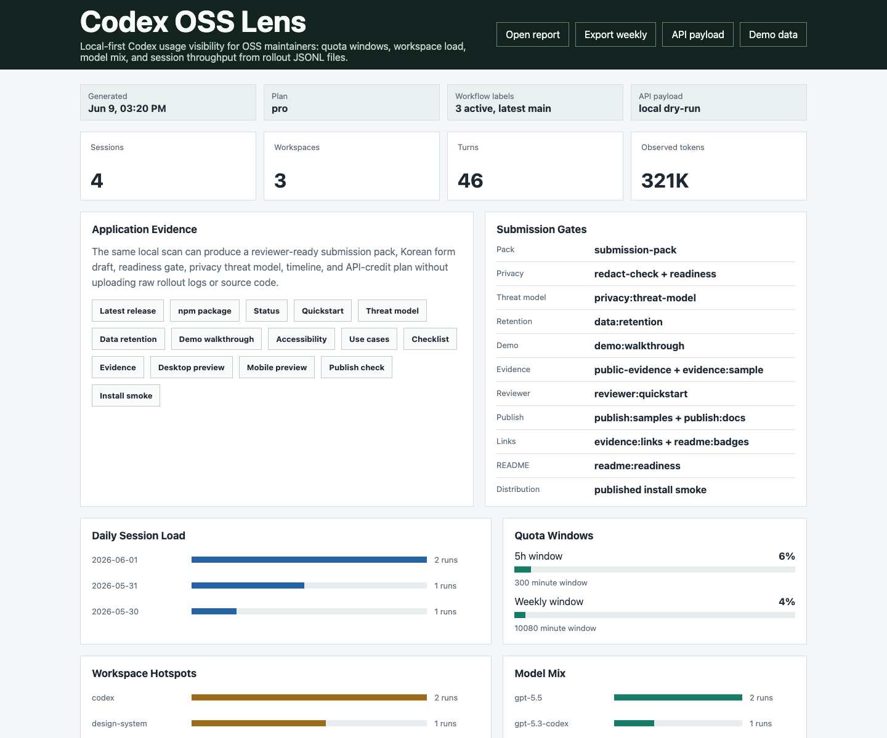
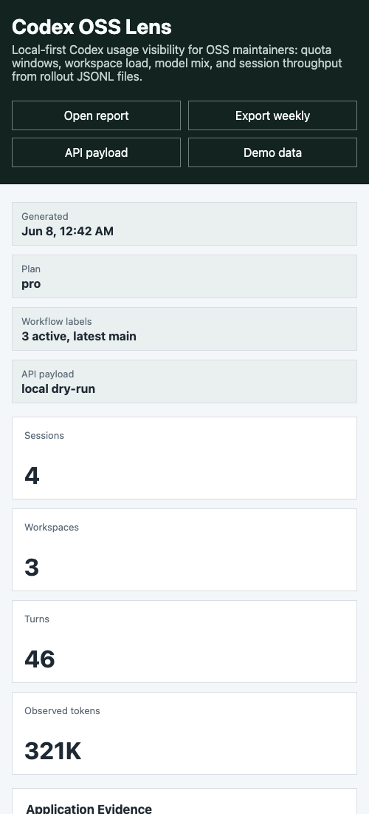

# Codex OSS Lens

[](https://github.com/dbunk903/codex-oss-lens/releases)
[](https://www.npmjs.com/package/codex-oss-lens)
[](https://github.com/dbunk903/codex-oss-lens/actions/workflows/test.yml)
[](https://github.com/dbunk903/codex-oss-lens/actions/workflows/published-smoke.yml)
[](LICENSE)
[](package.json)
[](docs/api-credit-workflow.md)

Codex OSS Lens is a local-first usage and workflow dashboard for OpenAI Codex maintainers.
It reads Codex rollout JSONL files from `~/.codex/sessions/` and turns them into a small
browser UI for quota windows, workspace load, model mix, recent sessions, and observed token
signals.

The goal is to help open-source maintainers answer practical questions before a review,
release, or triage sprint:

- Which repositories are consuming most Codex attention?
- Are 5-hour or weekly quota windows close to saturation?
- Which models are used across maintenance work?
- How many turns and tool calls are common in recent sessions?
- Which branch/commit was active during a Codex session?
- Is the recent workload implementation, review, triage, release, or security-oriented?
- Which Codex workflows deserve API-credit automation next?

## Why this exists

Existing Codex usage visibility is fragmented across CLI sessions, plan windows, and local JSONL
files. Maintainers need a fast way to understand where Codex is helping, where it is stuck, and
which maintenance workflows should be automated or improved.

Codex OSS Lens keeps that analysis local. It does not upload prompts, code, logs, or repository
paths to a hosted service.





## Try the published package

```bash
npx -y codex-oss-lens@latest serve --demo
```

The CLI is published on npm as
[`codex-oss-lens`](https://www.npmjs.com/package/codex-oss-lens). The package also includes the
public application docs, roadmap, and security policy so reviewers can inspect the same evidence
from the registry tarball.

For a global install:

```bash
npm install -g codex-oss-lens
codex-oss-lens serve --demo
```

For a registry smoke check without opening the UI:

```bash
npm exec --yes --package codex-oss-lens@latest -- codex-oss-lens demo
```

## Current status

| Area | Status |
| --- | --- |
| Local JSONL scan | Available |
| Dashboard preview | Available |
| Weekly Markdown export | Available |
| Path redaction | Basename, hash, or private full path |
| Git branch/commit context | Codex payload and local `.git` fallback |
| Workflow classification | Metadata-only heuristics |
| API summary payload | Aggregate-only dry run available |
| GitHub outcomes | Optional issue/PR metadata import through `gh` |
| Outcome links | Local branch-to-PR matching |
| Maintainer brief | Shareable evidence pack generation |
| Brief audit | Share-readiness score and next actions |
| Redaction check | Leak scan for shareable artifacts |
| Brief comparison | Day-over-day maintainer evidence deltas |
| Submission readiness | One-command go/no-go report |
| API credit plan | Prioritized privacy-first API automation plan |
| Activity timeline | Chronological maintainer activity evidence |
| Evidence index | Reviewer-friendly artifact index in JSON, Markdown, and HTML |
| Maintainer scorecard | Weighted application readiness score with next actions |
| Submission pack | One-command application evidence folder generation |
| Form draft | Copy-ready Korean OSS support application answers |
| Pack validation | Required-file, score, readiness, and privacy validation |
| NPM publish check | Login, registry, package metadata, and OTP guidance |
| Published install smoke | `npm exec` verification for the published CLI |
| Published package | Available on npm as `codex-oss-lens` |
| Published smoke CI | Scheduled and manual GitHub Actions verification |
| Public evidence | Application links and proof points in JSON and Markdown |

## Quick start

```bash
npm install
npm test
npm run serve
```

Then open `http://127.0.0.1:5057`.

The same UI can run from the published npm package:

```bash
npx -y codex-oss-lens@latest serve --demo
```

To write a report that can be opened in the static UI:

```bash
node src/cli.js scan --out examples/codex-lens-report.json
```

Workspace paths are redacted by default. For stable anonymous workspace ids:

```bash
node src/cli.js scan --redaction hash --out shareable-report.json
```

For a private local report with full paths:

```bash
node src/cli.js scan --show-paths --out private-report.json
```

To export a shareable weekly maintainer summary:

```bash
node src/cli.js weekly --out weekly-codex-report.md
```

To inspect the aggregate-only payload that a future API summary would send:

```bash
node src/cli.js api-payload --out api-payload.dry-run.json
```

To import public GitHub issue and pull request metadata for local comparison:

```bash
node src/cli.js github-import --repo dbunk903/codex-oss-lens --out github-outcomes.json
```

To link a scan report with imported GitHub outcomes:

```bash
node src/cli.js link-outcomes --report report.json --github github-outcomes.json --out linked-outcomes.json
```

To check local readiness without exposing rollout filenames or prompt content:

```bash
node src/cli.js doctor
```

To generate a full local evidence pack for review or OSS support applications:

```bash
node src/cli.js brief --repo dbunk903/codex-oss-lens --out-dir codex-brief
```

To audit whether that evidence pack is ready to share:

```bash
node src/cli.js audit --manifest codex-brief/manifest.json --out codex-brief/audit.json
```

To scan generated artifacts plus public repository metadata/templates for accidental paths, rollout
filenames, raw-log markers, or likely secrets:

```bash
node src/cli.js redact-check codex-brief --out codex-brief/redact-check.json
```

To compare two maintainer briefs across days:

```bash
node src/cli.js compare-briefs --base old-brief/manifest.json --head codex-brief/manifest.json --markdown brief-delta.md
```

To combine audit, redaction, and optional baseline comparison into one submission report:

```bash
node src/cli.js readiness --manifest codex-brief/manifest.json --base old-brief/manifest.json --markdown readiness.md
```

To turn a scan report into a prioritized API-credit implementation plan:

```bash
node src/cli.js api-plan --report codex-brief/scan-report.json --markdown api-plan.md
```

To generate a chronological activity timeline from a scan report:

```bash
node src/cli.js timeline --report codex-brief/scan-report.json --markdown timeline.md
```

To compose a reviewer-facing evidence index:

```bash
node src/cli.js evidence-index --manifest codex-brief/manifest.json --readiness readiness.json --api-plan api-plan.json --timeline timeline.json --html evidence-index.html
```

To produce a weighted maintainer application scorecard:

```bash
node src/cli.js scorecard --manifest codex-brief/manifest.json --readiness readiness.json --api-plan api-plan.json --timeline timeline.json --markdown scorecard.md
```

To generate the full application evidence folder in one command:

```bash
node src/cli.js submission-pack --repo dbunk903/codex-oss-lens --out-dir codex-submission-pack
```

To generate copy-ready Korean form answers from the same evidence:

```bash
node src/cli.js form-draft --manifest codex-submission-pack/manifest.json --readiness codex-submission-pack/readiness.json --api-plan codex-submission-pack/api-plan.json --scorecard codex-submission-pack/scorecard.json --repo https://github.com/dbunk903/codex-oss-lens --release-url https://github.com/dbunk903/codex-oss-lens/releases/tag/v1.6.1 --roadmap-url https://github.com/dbunk903/codex-oss-lens/blob/main/ROADMAP.md --api-workflow-url https://github.com/dbunk903/codex-oss-lens/blob/main/docs/api-credit-workflow.md --markdown form-draft.md
```

Pass the same reviewer evidence URLs used by `public-evidence` when you want the form draft to
include the full public link map; `npm run form-draft:sample` checks that sample shape.

To validate a generated submission pack before sharing it:

```bash
node src/cli.js pack-validate codex-submission-pack --markdown pack-validation.md
```

To collect final public links and proof points for an OSS support application:

```bash
node src/cli.js public-evidence --markdown public-evidence.md
npm run submission:check
```

For a fork or a later release, override reviewer links from the same command:

```bash
node src/cli.js public-evidence \
  --repo https://github.com/owner/project \
  --release-url https://github.com/owner/project/releases/tag/v1.2.3 \
  --npm-package https://www.npmjs.com/package/package-name \
  --roadmap-url https://github.com/owner/project/blob/main/ROADMAP.md \
  --application-status-url https://github.com/owner/project/blob/main/docs/application-status.md \
  --application-evidence-matrix-url https://github.com/owner/project/blob/main/docs/application-evidence-matrix.md \
  --application-review-faq-url https://github.com/owner/project/blob/main/docs/application-review-faq.md \
  --submission-risk-register-url https://github.com/owner/project/blob/main/docs/submission-risk-register.md \
  --submission-decision-summary-url https://github.com/owner/project/blob/main/docs/submission-decision-summary.md \
  --submission-activity-log-url https://github.com/owner/project/blob/main/docs/submission-activity-log.md \
  --reviewer-quickstart-url https://github.com/owner/project/blob/main/docs/reviewer-quickstart.md \
  --signed-out-review-url https://github.com/owner/project/blob/main/docs/signed-out-review.md \
  --release-provenance-url https://github.com/owner/project/blob/main/docs/release-provenance.md \
  --adoption-plan-url https://github.com/owner/project/blob/main/docs/adoption-plan.md \
  --adoption-snapshot-url https://github.com/owner/project/blob/main/docs/adoption-snapshot.md \
  --maintenance-policy-url https://github.com/owner/project/blob/main/docs/maintenance-policy.md \
  --maintainer-handoff-url https://github.com/owner/project/blob/main/docs/maintainer-handoff.md \
  --scope-limitations-url https://github.com/owner/project/blob/main/docs/scope-and-limitations.md \
  --privacy-threat-model-url https://github.com/owner/project/blob/main/docs/privacy-threat-model.md \
  --data-retention-url https://github.com/owner/project/blob/main/docs/data-retention.md \
  --demo-walkthrough-url https://github.com/owner/project/blob/main/docs/demo-walkthrough.md \
  --accessibility-url https://github.com/owner/project/blob/main/docs/accessibility.md \
  --api-workflow-url https://github.com/owner/project/blob/main/docs/api-credit-workflow.md \
  --use-cases-url https://github.com/owner/project/blob/main/docs/maintainer-use-cases.md \
  --final-checklist-url https://github.com/owner/project/blob/main/docs/final-submission-checklist.md \
  --submission-rehearsal-url https://github.com/owner/project/blob/main/docs/submission-rehearsal.md \
  --final-copy-url https://github.com/owner/project/blob/main/application/final-copy.md \
  --form-draft-sample-url https://github.com/owner/project/blob/main/examples/form-draft.sample.md \
  --public-evidence-sample-url https://github.com/owner/project/blob/main/examples/public-evidence.sample.md \
  --dashboard-preview-url https://github.com/owner/project/blob/main/examples/dashboard-preview.png \
  --mobile-dashboard-preview-url https://github.com/owner/project/blob/main/examples/dashboard-mobile-preview.png \
  --publish-check-sample-url https://github.com/owner/project/blob/main/examples/publish-check.sample.md \
  --install-smoke-sample-url https://github.com/owner/project/blob/main/examples/install-smoke.sample.md \
  --node-ci-url https://github.com/owner/project/actions/workflows/test.yml \
  --published-smoke-url https://github.com/owner/project/actions/workflows/published-smoke.yml \
  --markdown public-evidence.md
```

The public application status snapshot is maintained at
`docs/application-status.md` so reviewers can distinguish published evidence from account-owner
manual submit gates.

For narrower copy or link checks while editing:

```bash
npm run final-copy:check
npm run submission:versions
npm run application:status
npm run application:evidence
npm run reviewer:faq
npm run submission:risk
npm run submission:decision
npm run submission:activity
npm run reviewer:quickstart
npm run reviewer:signedout
npm run submitter:handoff
npm run form-draft:sample
npm run publish:samples
npm run publish:docs
npm run dashboard:readiness
npm run ci:readiness
npm run contrib:readiness
npm run security:readiness
npm run support:readiness
npm run conduct:readiness
npm run license:readiness
npm run issue-routing:readiness
npm run release:provenance
npm run adoption:readiness
npm run adoption:snapshot
npm run maintenance:readiness
npm run maintainer:handoff
npm run scope:limitations
npm run privacy:threat-model
npm run accessibility:readiness
npm run data:retention
npm run demo:walkthrough
npm run submission:rehearsal
npm run public:redaction
npm run evidence:sample
npm run evidence:links
npm run readme:badges
npm run readme:readiness
```

The badge gate retries transient badge fetch failures so a temporary Shields, GitHub raw, or
rate-limit response does not mask the real readiness signal.

Reviewer-facing entry points:

- Application status: https://github.com/dbunk903/codex-oss-lens/blob/main/docs/application-status.md
- Application evidence matrix: https://github.com/dbunk903/codex-oss-lens/blob/main/docs/application-evidence-matrix.md
- Application review FAQ: https://github.com/dbunk903/codex-oss-lens/blob/main/docs/application-review-faq.md
- Submission risk register: https://github.com/dbunk903/codex-oss-lens/blob/main/docs/submission-risk-register.md
- Submission decision summary: https://github.com/dbunk903/codex-oss-lens/blob/main/docs/submission-decision-summary.md
- Submission activity log: https://github.com/dbunk903/codex-oss-lens/blob/main/docs/submission-activity-log.md
- Reviewer quickstart: https://github.com/dbunk903/codex-oss-lens/blob/main/docs/reviewer-quickstart.md
- Signed-out review: https://github.com/dbunk903/codex-oss-lens/blob/main/docs/signed-out-review.md
- Submitter handoff: https://github.com/dbunk903/codex-oss-lens/blob/main/docs/submitter-handoff.md
- Release provenance: https://github.com/dbunk903/codex-oss-lens/blob/main/docs/release-provenance.md
- Adoption plan: https://github.com/dbunk903/codex-oss-lens/blob/main/docs/adoption-plan.md
- Adoption snapshot: https://github.com/dbunk903/codex-oss-lens/blob/main/docs/adoption-snapshot.md
- Maintenance policy: https://github.com/dbunk903/codex-oss-lens/blob/main/docs/maintenance-policy.md
- Maintainer handoff: https://github.com/dbunk903/codex-oss-lens/blob/main/docs/maintainer-handoff.md
- Scope and limitations: https://github.com/dbunk903/codex-oss-lens/blob/main/docs/scope-and-limitations.md
- Privacy threat model: https://github.com/dbunk903/codex-oss-lens/blob/main/docs/privacy-threat-model.md
- Accessibility notes: https://github.com/dbunk903/codex-oss-lens/blob/main/docs/accessibility.md
- Data retention: https://github.com/dbunk903/codex-oss-lens/blob/main/docs/data-retention.md
- Demo walkthrough: https://github.com/dbunk903/codex-oss-lens/blob/main/docs/demo-walkthrough.md
- Support policy: https://github.com/dbunk903/codex-oss-lens/blob/main/SUPPORT.md
- Code of conduct: https://github.com/dbunk903/codex-oss-lens/blob/main/CODE_OF_CONDUCT.md
- Final submission checklist: https://github.com/dbunk903/codex-oss-lens/blob/main/docs/final-submission-checklist.md
- Submission rehearsal: https://github.com/dbunk903/codex-oss-lens/blob/main/docs/submission-rehearsal.md
- Public evidence sample: https://github.com/dbunk903/codex-oss-lens/blob/main/examples/public-evidence.sample.md
- Dashboard preview: https://github.com/dbunk903/codex-oss-lens/blob/main/examples/dashboard-preview.png
- Mobile dashboard preview: https://github.com/dbunk903/codex-oss-lens/blob/main/examples/dashboard-mobile-preview.png
- Publish check sample: https://github.com/dbunk903/codex-oss-lens/blob/main/examples/publish-check.sample.md
- Install smoke sample: https://github.com/dbunk903/codex-oss-lens/blob/main/examples/install-smoke.sample.md

The dashboard preview images are kept as `1440x1200` desktop and `500x1100` mobile artifacts by
`npm run dashboard:readiness`; `npm run evidence:links` also checks those dimensions through the
public GitHub raw URLs and retries transient network failures before marking a public link broken.

To check npm publish readiness, including login, package metadata, registry status, and OTP command
guidance:

```bash
node src/cli.js publish-check --markdown publish-check.md
```

After publishing, verify the public package can install and run through `npm exec`:

```bash
node src/cli.js install-smoke --package codex-oss-lens --version latest --markdown install-smoke.md
```

To preview without local Codex logs:

```bash
node src/cli.js serve --demo
```

## CLI

```bash
codex-oss-lens scan [--codex-home ~/.codex] [--limit 250] [--out report.json]
codex-oss-lens weekly [--codex-home ~/.codex] [--limit 250] [--out weekly.md]
codex-oss-lens api-payload [--codex-home ~/.codex] [--limit 250] [--out payload.json]
codex-oss-lens github-import --repo owner/name [--limit 50] [--out github-outcomes.json]
codex-oss-lens link-outcomes --report report.json --github github-outcomes.json [--out linked.json]
codex-oss-lens doctor [--codex-home ~/.codex] [--out doctor.json]
codex-oss-lens brief [--codex-home ~/.codex] [--repo owner/name] [--out-dir codex-brief]
codex-oss-lens audit --manifest codex-brief/manifest.json [--out audit.json]
codex-oss-lens redact-check <file-or-dir> [--out redact-check.json]
codex-oss-lens compare-briefs --base old/manifest.json --head new/manifest.json [--out compare.json] [--markdown compare.md]
codex-oss-lens readiness --manifest codex-brief/manifest.json [--path codex-brief] [--base old/manifest.json] [--out readiness.json] [--markdown readiness.md]
codex-oss-lens api-plan --report scan-report.json [--out api-plan.json] [--markdown api-plan.md]
codex-oss-lens timeline --report scan-report.json [--out timeline.json] [--markdown timeline.md]
codex-oss-lens scorecard --manifest manifest.json [--readiness readiness.json] [--api-plan api-plan.json] [--timeline timeline.json] [--out scorecard.json] [--markdown scorecard.md]
codex-oss-lens evidence-index --manifest manifest.json [--readiness readiness.json] [--api-plan api-plan.json] [--timeline timeline.json] [--scorecard scorecard.json] [--form-draft form-draft.json] [--out evidence-index.json] [--markdown evidence-index.md] [--html evidence-index.html]
codex-oss-lens submission-pack [--codex-home ~/.codex] [--repo owner/name] [--out-dir codex-submission-pack] [--demo]
codex-oss-lens form-draft --manifest manifest.json [--readiness readiness.json] [--api-plan api-plan.json] [--scorecard scorecard.json] [--repo url] [--release-url url] [--npm-package url] [--roadmap-url url] [--application-status-url url] [--application-evidence-matrix-url url] [--application-review-faq-url url] [--submission-risk-register-url url] [--submission-decision-summary-url url] [--submission-activity-log-url url] [--reviewer-quickstart-url url] [--signed-out-review-url url] [--release-provenance-url url] [--adoption-plan-url url] [--adoption-snapshot-url url] [--maintenance-policy-url url] [--maintainer-handoff-url url] [--scope-limitations-url url] [--privacy-threat-model-url url] [--data-retention-url url] [--demo-walkthrough-url url] [--accessibility-url url] [--api-workflow-url url] [--use-cases-url url] [--final-checklist-url url] [--submission-rehearsal-url url] [--final-copy-url url] [--form-draft-sample-url url] [--public-evidence-sample-url url] [--dashboard-preview-url url] [--mobile-dashboard-preview-url url] [--publish-check-sample-url url] [--install-smoke-sample-url url] [--node-ci-url url] [--published-smoke-url url] [--out form-draft.json] [--markdown form-draft.md]
codex-oss-lens pack-validate <submission-pack-dir> [--min-score 75] [--out pack-validation.json] [--markdown pack-validation.md]
codex-oss-lens publish-check [--package-json package.json] [--out publish-check.json] [--markdown publish-check.md]
codex-oss-lens install-smoke [--package codex-oss-lens] [--version latest] [--bin codex-oss-lens] [--out install-smoke.json] [--markdown install-smoke.md]
codex-oss-lens public-evidence [--repo url] [--release-url url] [--npm-package url] [--roadmap-url url] [--application-status-url url] [--application-evidence-matrix-url url] [--application-review-faq-url url] [--submission-risk-register-url url] [--submission-decision-summary-url url] [--submission-activity-log-url url] [--reviewer-quickstart-url url] [--signed-out-review-url url] [--release-provenance-url url] [--adoption-plan-url url] [--adoption-snapshot-url url] [--maintenance-policy-url url] [--maintainer-handoff-url url] [--scope-limitations-url url] [--privacy-threat-model-url url] [--data-retention-url url] [--demo-walkthrough-url url] [--accessibility-url url] [--api-workflow-url url] [--use-cases-url url] [--final-checklist-url url] [--submission-rehearsal-url url] [--final-copy-url url] [--form-draft-sample-url url] [--public-evidence-sample-url url] [--dashboard-preview-url url] [--mobile-dashboard-preview-url url] [--publish-check-sample-url url] [--install-smoke-sample-url url] [--node-ci-url url] [--published-smoke-url url] [--out public-evidence.json] [--markdown public-evidence.md]
codex-oss-lens serve [--codex-home ~/.codex] [--port 5057] [--demo]
codex-oss-lens demo [--out report.json]
```

## Data model

Codex OSS Lens scans files matching:

```text
~/.codex/sessions/**/rollout-*.jsonl
```

It extracts:

- session metadata: id, start/end timestamps, workspace, model
- workflow metrics: turn count, tool-call count, duration
- Git metadata: branch and short commit when Codex logs or local `.git` metadata provide it
- workflow classification: implementation, review, triage, release, security, or unknown
- token signals when available in `token_count` or `usage` payloads
- quota windows from `rate_limits.primary` and `rate_limits.secondary`

Older Codex logs may not contain token usage details. In that case the dashboard still shows
session, workspace, model, turn, tool, and quota-window data.

Full workspace paths are redacted unless `--show-paths` is passed. Use `--redaction hash`
when a report needs stable workspace identities without exposing names.

See [report schema](docs/report-schema.md) for the generated JSON shape.

## Privacy posture

- Raw rollout JSONL stays on the local machine.
- Shareable exports redact workspace paths by default.
- Workflow labels are derived from metadata such as branch names, event categories, and counts.
- Future API-backed features should start with a dry-run payload and explicit opt-in.

See [privacy threat model](docs/privacy-threat-model.md) for protected inputs, shareable outputs,
trust boundaries, and opt-in requirements for future API-backed features.
See [accessibility notes](docs/accessibility.md) for keyboard, landmark, viewport, and screenshot
review expectations.
See [demo walkthrough](docs/demo-walkthrough.md) for npm latest CLI and dashboard checks that do
not require private Codex logs.

## Roadmap

- Redaction controls for workspace path display
- Cost estimation profiles by model and plan
- Exportable weekly maintainer report
- GitHub issue/PR labels to connect Codex usage with maintenance outcomes
- Optional OpenAI API summarization of local-only aggregate metrics

See [API-credit workflow](docs/api-credit-workflow.md) for the privacy-first API plan.
See [npm publishing](docs/npm-publishing.md) for package verification steps.
See [application evidence matrix](docs/application-evidence-matrix.md) for a reviewer-question to
proof-link crosswalk.
See [application review FAQ](docs/application-review-faq.md) for concise answers to young-project,
public-proof, manual-submit, privacy, package-boundary, and API-credit questions.
See [submission risk register](docs/submission-risk-register.md) for known application risks,
mitigations, local gates, and submit-time stop conditions.
See [submission decision summary](docs/submission-decision-summary.md) for Go/Stop conditions before
manual account-owner submission.
See [submission activity log](docs/submission-activity-log.md) for recent public readiness work and
the local gates behind it.
See [signed-out review checklist](docs/signed-out-review.md) for public-browser verification of
reviewer links and previews.
See [submitter handoff](docs/submitter-handoff.md) for paste-ready inputs, account-owner-only
fields, do-not-paste guards, and final browser order.
See [maintainer use cases](docs/maintainer-use-cases.md) for practical OSS workflows this tool
supports.
See [adoption plan](docs/adoption-plan.md) for the public validation loop for this young project.
See [adoption snapshot](docs/adoption-snapshot.md) for current public signals and claims not made.
See [maintenance policy](docs/maintenance-policy.md) for triage, release, and privacy-maintenance
expectations.
See [maintainer handoff](docs/maintainer-handoff.md) for continuity, release, and privacy guards.
See [scope and limitations](docs/scope-and-limitations.md) for current capabilities, non-goals,
manual gates, and source-vs-published boundaries.
See [privacy threat model](docs/privacy-threat-model.md) for protected inputs and API opt-in
boundaries.
See [demo walkthrough](docs/demo-walkthrough.md) for npm latest demo commands and expected
reviewer signals.
See [reviewer quickstart](docs/reviewer-quickstart.md) for the fastest public-only validation path.
See [submission rehearsal](docs/submission-rehearsal.md), [submitter handoff](docs/submitter-handoff.md),
[final submission checklist](docs/final-submission-checklist.md), and [final copy](application/final-copy.md)
for form-ready application material.

## Maintainer Brief

`codex-oss-lens brief` creates a local folder containing:

- `brief.md` and `brief.html`
- `scan-report.json`
- `weekly-report.md`
- `api-payload.dry-run.json`
- `doctor.json`
- optional `github-outcomes.json` and `linked-outcomes.json` when `--repo` is supplied

This is the recommended artifact for sharing a privacy-preserving snapshot of Codex maintainer
activity.

Run `audit`, `redact-check`, and `compare-briefs` before sharing repeated evidence packs. These
commands make the share-readiness score, privacy scan, and day-over-day deltas explicit instead of
leaving them as manual review notes.

For application workflows, `readiness` combines those checks into a single go/no-go report, and
`api-plan` converts aggregate scan data into a privacy-first API credit implementation sequence.
Use `timeline` to show chronological maintenance activity and `evidence-index` to package the
generated files into a reviewer-facing starting point.
Use `scorecard` for a weighted readiness score and `submission-pack` when you want the whole
application evidence folder generated in one pass.
Use `form-draft` to keep Korean application answers within character limits, then run
`pack-validate` as the final local sharing gate. Use `npm run submission:check` before opening the
application form, `publish-check` before npm release attempts, and `install-smoke` after release to
prove the public package installs and runs.

## Contributing

See [CONTRIBUTING.md](CONTRIBUTING.md). Bug reports and integration requests are welcome,
especially examples from maintainers using Codex across multiple repositories.

## License

[MIT](LICENSE)
